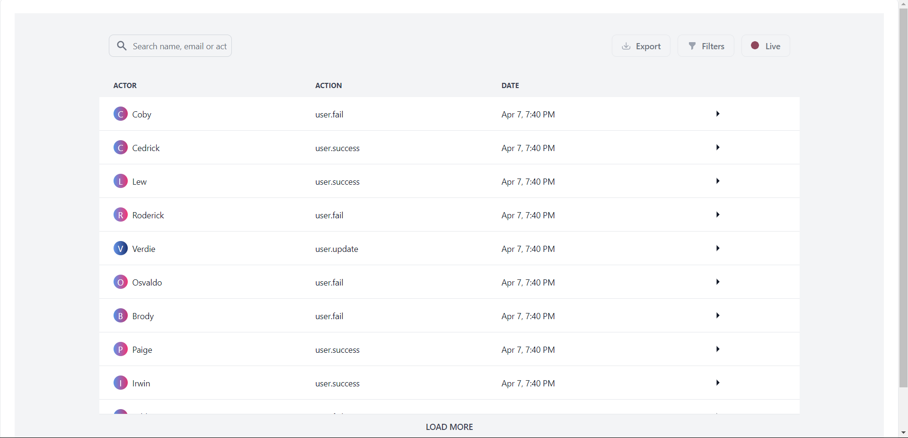

# Instalog
 This repository contains the Audit Logs implementation for Instalog, an activity log system for tracking user actions within applications.

 For more details, refer to the readme of each section
 ## [Backend](https://github.com/mahmoudjobeel1/Audit-Logs/tree/main/backend)
 ## [Frontend](https://github.com/mahmoudjobeel1/Audit-Logs/tree/main/frontend)

 