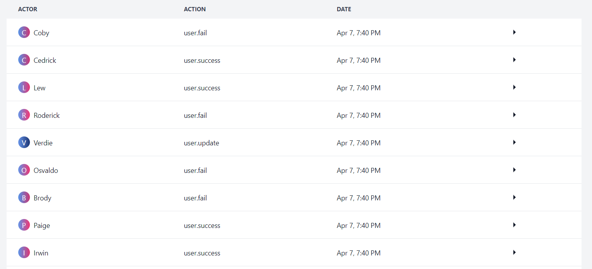
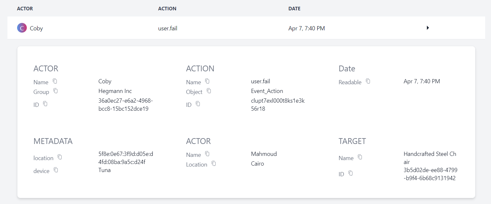
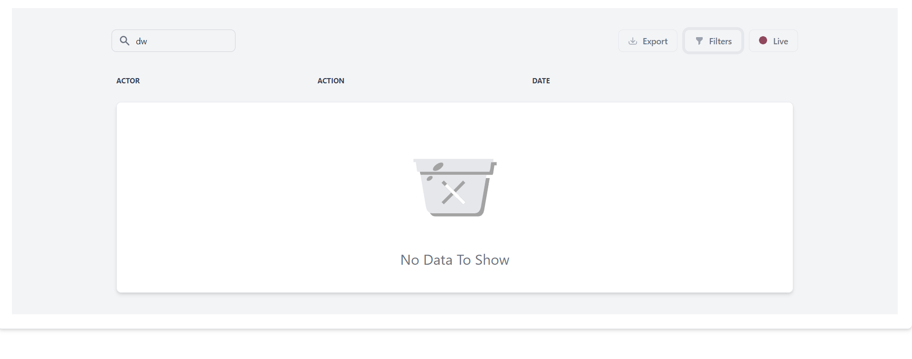
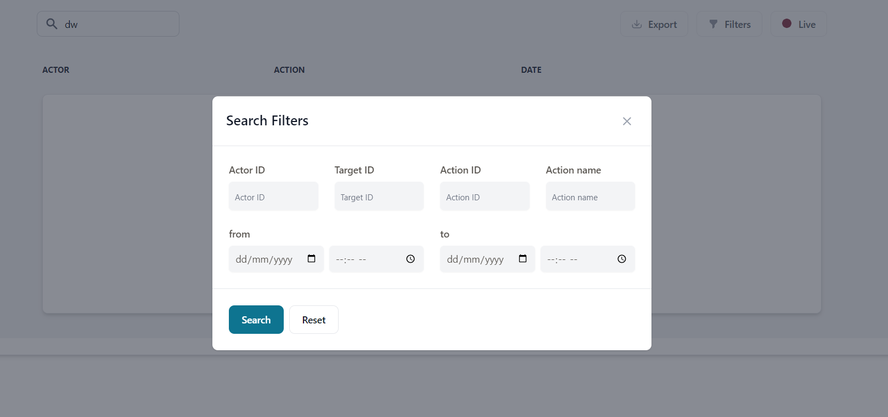

# Audit Logs Frontend

## Demo

Check out the live demo of the Audit Logs Frontend: [Demo Link](https://audit-logs-frontend.onrender.com)

Make sure to send a request firstly to the [backend](https://audit-logs-backend.onrender.com) to activate it.

## Frontend functionality:
- Listing 

- Details

- Load more
- Search

- Filter rows

- Live view (with a toggle to turn on or off)
- Export to CSV

## Tech Stack

- **Language**: 
    - TypeScript
    - React
    - Zustand
    - TailwindCss
    - FlowBite react
    - SWR

- **Deployment**: Render

## Getting Started

To set up the Instalog frontend locally, follow these steps:

1. Clone this repository: `git clone https://github.com/mahmoudjobeel1/Audit-Logs/tree/main/frontend`
2. Install dependencies: `npm install`
3. Start the server: `npm start`

## New Features
- ### Applying List Visualization (Window)
    - Description: Implement list visualization with windowing technique to optimize rendering performance and handle large datasets efficiently.

- ### Adding Filters as Search Tags
    - Description: Enhance the filtering mechanism by converting selected filters into search tags, allowing users to easily view and remove applied filters.

- ### Adding Filters to the Page URL for URL Sharing
    - Description: Enable users to share filtered views of data by updating the page URL with applied filters, allowing recipients to access the same filtered view.

